# codePush

### React-Native + Typescript 프로젝트 생성

```bash
npx react-native init MyAwesomeProject --template react-native-template-typescript
```

* 참고 Microsoft React-Native Typescript starter 가이드

[https://github.com/Microsoft/TypeScript-React-Native-Starter](https://github.com/Microsoft/TypeScript-React-Native-Starter)

## 준비

```bash
yarn global add appcenter-cli
appcenter login
```


- appcenter-cli를 설치한 후에 appcenter register 명령어를 터미널에 입력하면 appcenter사이트가 열리고 로그인이 된 상태라면 위 이미지처럼 토큰이 나타나게 됩니다. 이걸 복사해서 터미널에 붙여넣기 합니다.
    
    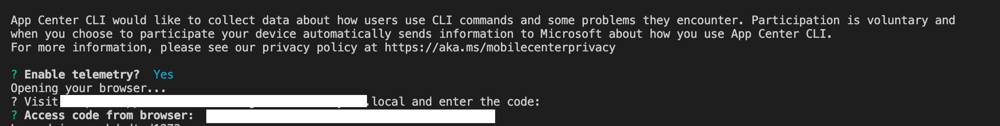
    
- 그리고 앱센터에서 android/ios 앱을 추가해줍니다.터미널에서 아래 명령어로 추가해 줄 수도 있습니다.

```bash
appcenter apps create -d {appName-android} -o Android -p React-Native
appcenter apps create -d {appName-ios} -o iOS -p React-Native
```

### codePush 모듈 설치

```bash
yarn add react-native-code-push
yarn add appcenter appcenter-analytics appcenter-crashes --exact
cd ../ios
pod install --repo-update
```

## ios

- 앱센터에서 앱을 선택하면  Overview란 메뉴가 나오는데 여기서 설명한대로 셋팅하면 되지만 아래에 순서대로 설명하도록 하겠습니다.
    
    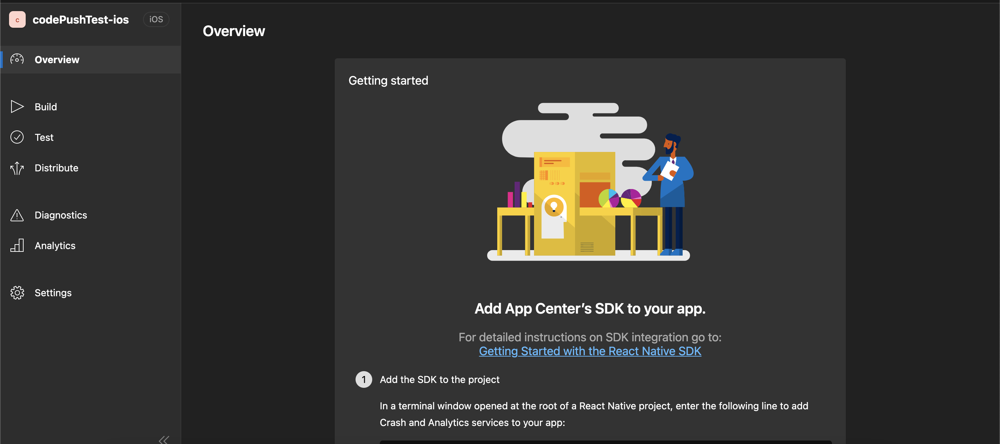
    

1. AppCenter-Config.plist 파일을 추가해줍니다. 
- 파일안에 내용은 앱센터 Overview메뉴 Getting started 2번에 나와있습니다.
    
    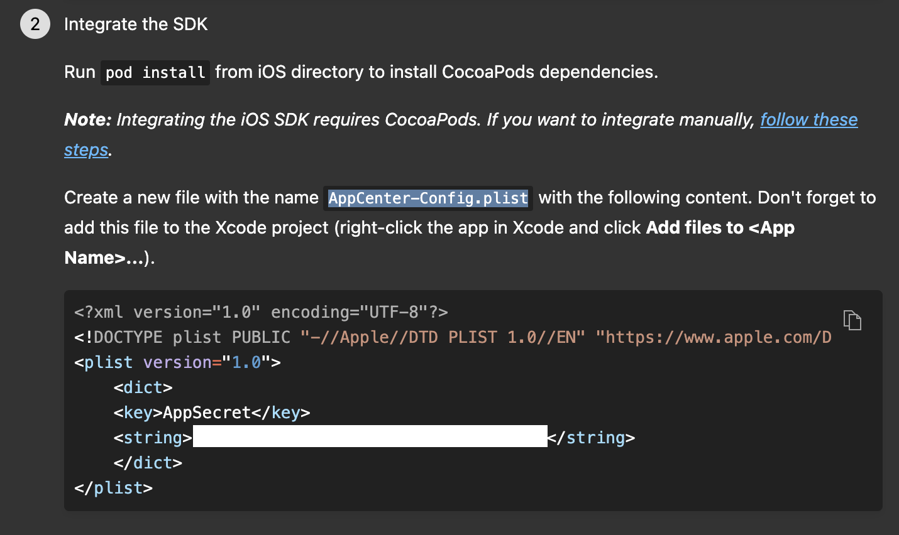
    
- AppCenter-Config.plist 파일 추가하는법
xcode에서 프로젝트폴더에서 우클릭 후 New File로 AppCenter-Config.plist파일을 추가해줍니다. 자세한 설명은 아래 사진으로 첨부하겠습니다.
    
    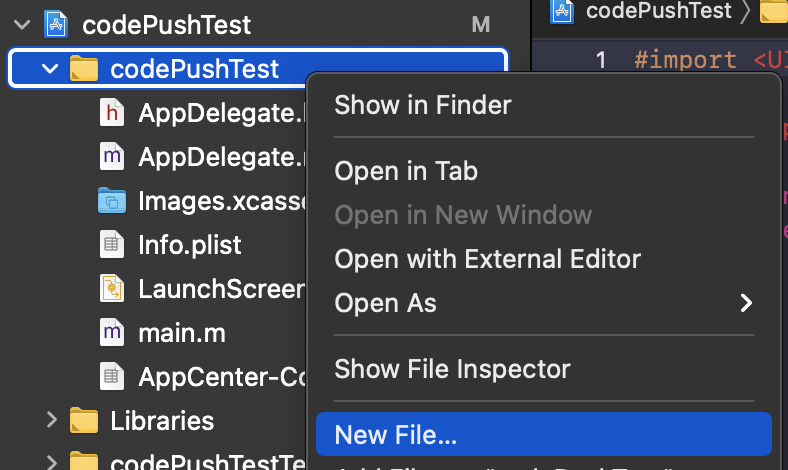
    
    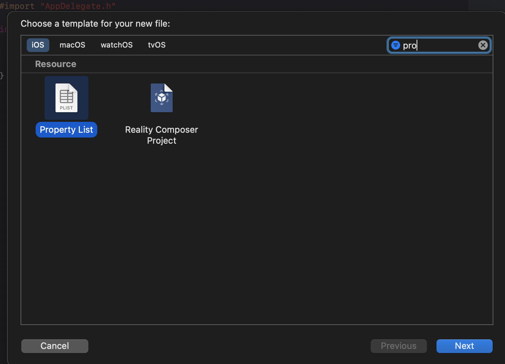
    
    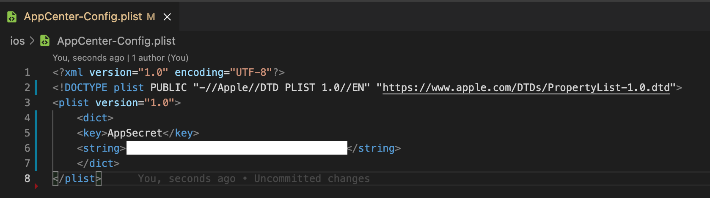
    

1. **ios/{ProjectName}/`AppDelegate.m`** 파일에서 아래 모듈들을 **import** 시켜줍니다.

```objectivec
// #ifdef FB_SONARKIT_ENABLED 위에 추가해줍니다.
#import <CodePush/CodePush.h>
#import <AppCenterReactNative.h>
#import <AppCenterReactNativeAnalytics.h>
#import <AppCenterReactNativeCrashes.h>
```

1. `AppDelegate.m` 폴더에서 아래 코드를 수정해줍니다.

```objectivec
- return [[NSBundle mainBundle] URLForResource:@"main" withExtension:@"jsbundle"];
=>
+ return [CodePush bundleURL];
```

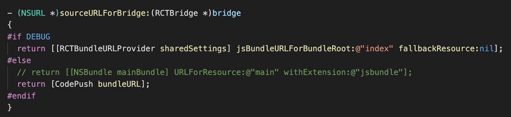

1. 아래 코드를 `didFinishLaunchingWithOptions` 메서드에 추가합니다.

```objectivec
- (BOOL)application:(UIApplication *)application didFinishLaunchingWithOptions:(NSDictionary *)launchOptions
{
// ... 
	+ [AppCenterReactNative register];
	+ [AppCenterReactNativeAnalytics registerWithInitiallyEnabled:true];
	+ [AppCenterReactNativeCrashes registerWithAutomaticProcessing];
// ...
```

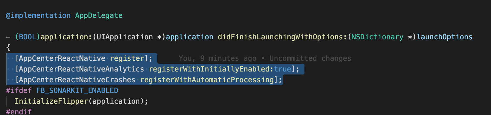

1. **ios/{ProjectName}/info.plist** 파일에서 코드푸쉬 키를 추가해줍니다.

```
<key>CodePushDeploymentKey</key>
<string>{codepush key}</string>
```

- 코드푸쉬 production, staging 키 확인 방법
터미널에 appcenter codepush deployment list —app {owner}/{appName} -k 명령어를 입력하면 키가 나옵니다.
    
    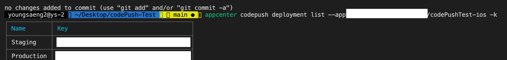
    
- {owner}/{appName}을 모르겠으면 appcenter apps list 명령어를 입력하면 앱센터에 등록된 앱리스트가 나오게 됩니다.

## Android

- 앱센터에서 android앱을 선택 후 Overview메뉴에서 Getting started 2번을 먼저 실행해줍니다.

1. **android/app/src/main/assets** 폴더에서 (assets폴더가 없으면 추가하면 됩니다.) 
appcenter-config.json파일을 추가후 아래 코드를 추가해줍니다.(앱센터 android앱 Overview메뉴 2번에 추가해야되는 코드가 있습니다.)
    
    ```json
    {
    	"app_secret":{app_secret_code}
    }
    ```
    
    **res/values/strings.xml** 파일에서 아래 코드 추가
    
    ```xml
    <string name="appCenterCrashes_whenToSendCrashes" moduleConfig="true" translatable="false">DO_NOT_ASK_JAVASCRIPT</string>
    <string name="appCenterAnalytics_whenToEnableAnalytics" moduleConfig="true" translatable="false">ALWAYS_SEND</string>
    ```
    
    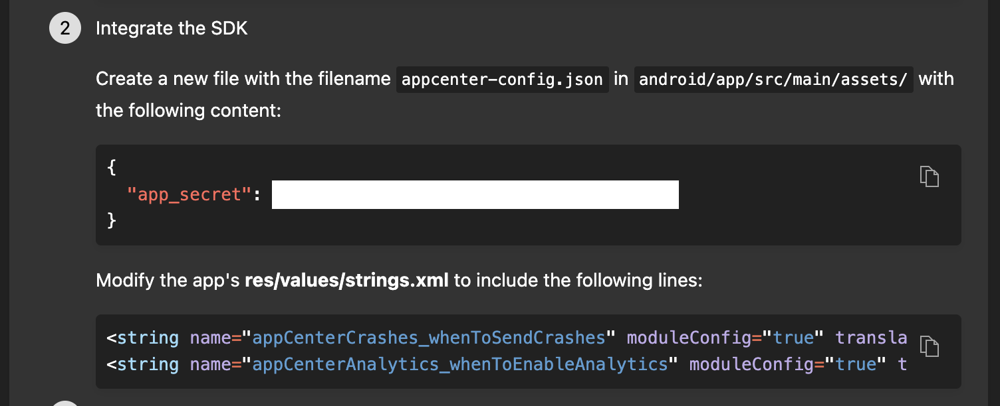
    

1. **android/settings.gradle**에서 아래 코드 추가

```java
include ':app', ':react-native-code-push'
project(':react-native-code-push').projectDir = new File(rootProject.projectDir, '../node_modules/react-native-code-push/android/app')
```

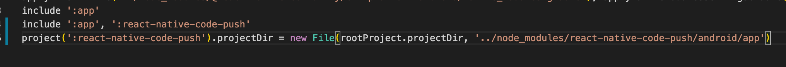

1. **android/app/build.gradle**에서 아래 코드 추가

```java
...
+ apply from: "../../node_modules/react-native/react.gradle"
+ apply from: "../../node_modules/react-native-code-push/android/codepush.gradle"
...
```

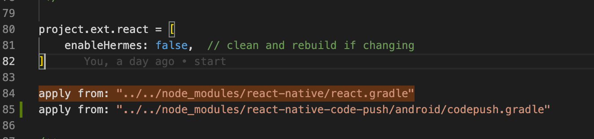

1. **MainApplication.java**파일에서 아래 코드 추가 앞에 +가 붙은 코드만 넣으면 됩니다.

```java
...
+ import com.microsoft.codepush.react.CodePush;

public class MainApplication extends Application implements ReactApplication {
    private final ReactNativeHost mReactNativeHost = new ReactNativeHost(this) {
        ...
        + @Override
        + protected String getJSBundleFile() {
        +     return CodePush.getJSBundleFile();
        + }
    };
}
```

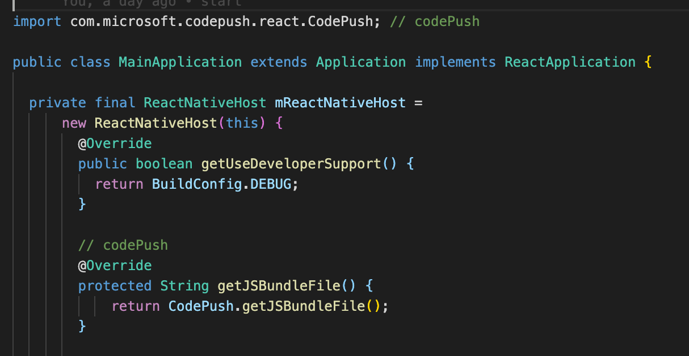

1. **strings.xml** 파일에 코드푸쉬 키를 추가해줍니다.

```xml
<string moduleConfig="true" name="CodePushDeploymentKey">{DeploymentKey}</string>
```

- ios와 마찬가지로 key를 확인하는 명령어를 터미널에 입력해서 key를 확인 합니다.
appcenter codepush deployment list —app {owner}/{appName} -k

## 배포

```bash
appcenter codepush release-react -a {owner}/{appName} -d {Production or Staging}
```

## **Plugin Usage**

```jsx
import codePush from 'react-native-code-push';

```
